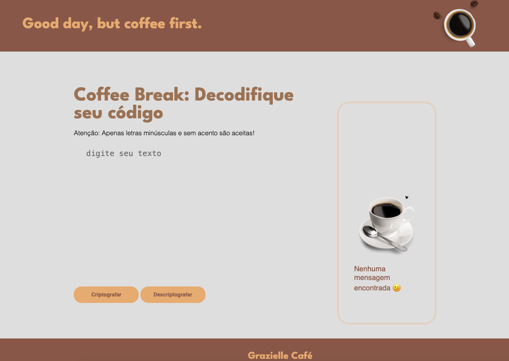

<h1 style="color:orange">☕ Coffee Break ☕</h1>

<h3>▪️ O codificador e decodificador de textos</h3>

Esse é um projeto para entrega do Challenge do curso de formação de iniciantes em programação através da Oracle em parceria com a Alura. 

O objetivo do desafio é criar um programa para criptografar e descriptografar textos seguindo as instruções do desafio.

<h3>▪️ As "chaves" que foram utilizadas para a criptografia: 🗝️</h3> <br>

A letra "e" é convertida para "enter"<br>
A letra "i" é convertida para "imes"<br>
A letra "a" é convertida para "ai"<br>
A letra "o" é convertida para "ober"<br>
A letra "u" é convertida para "ufat"<br>

<h2 style="color:orange">▪️ Tema - Coffee Break ☕ </h2> <br>

A escolha das cores e do projeto foram baseados no meu sobrenome "Café" remetendo ao momento de "Coffee Break" como pausa para um café e ao de "quebrar algo", no caso de criptografar e descriptografar um texto. 
<br><br>

<br> 


<h3>▪️ Explicando as funções no JavaScript</h3>
<br>

-```exibirTextoSaida(tag, texto)```<br> 
Função para exibir textos de saída;<br>

-```output()```<br>
Função para ocultar a imagem, limpar o h3 e mostrar o botão de copiar;<br>

-```removeDiacritics(str)```<br>
Função para remover diacríticos;<br>

-```criptografar()```<br>
Funções para criptografar o texto;<br>

-```descriptografar()```<br>
Função para descriptografar o texto;<br>

-```botaoCopiarTexto()```<br>
Função para copiar o texto de saída para a área de transferência;<br>


Link do programa: https://challenge-decodificador-sandy-ten.vercel.app/
